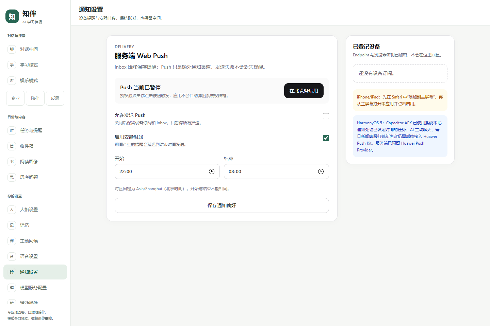
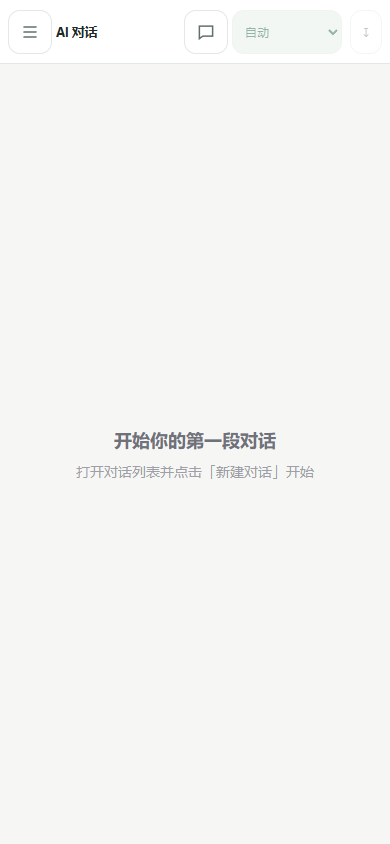

# R2：全模式 UI 与导航规范

最近更新：2026-10-02。Web 与 Capacitor 本地 React Client 共用本规范与组件，未新增 UI 库或 Android 业务页面。

## 1. 导航选择与草图

原界面每页各自维护导航，聊天标题栏塞入模式、导出和许多设置链接；手机难以发现学习/娱乐入口。先比较两种方案：

- 常驻底栏：常用项易找，但专业/陪伴/反思与学习/娱乐语义不同，加上任务/Inbox/设置会拥挤，也占用输入与键盘空间。
- 分组侧栏 + 手机抽屉：主导航覆盖所有页面，桌面持续可见；手机平时只保留一个 44px 的入口。聊天历史独立，正文获得完整宽度。

本轮选择第二种，不新增底栏。

```text
桌面 ≥ 1024px
┌───────────────┬─────────────────────────────────────┐
│ 知伴          │ 当前页面 / 聊天模式与导出             │
│ 对话 / 学习   ├─────────────────────────────────────┤
│ 娱乐          │ 内容、活动或设置                      │
│ 日常与内容    │ 聊天：历史栏 | 主要正文               │
│ 你的设置      │                  多行输入             │
└───────────────┴─────────────────────────────────────┘

手机 360 / 390px
┌──────────────────────────────────┐
│ ☰ 当前页面  [历史][模式][导出]    │  后三项仅聊天
├──────────────────────────────────┤
│ 主要正文 / 活动 / 设置            │  不显示常驻导航
│                                  │
│ 聊天输入与发送                   │
└──────────────────────────────────┘
☰ → 分组导航；历史 → 当前会话列表；两者不混用。
```

## 2. 页面与模式的契约

- “对话空间”只是进入 `/chat`；专业、陪伴、反思入口是 `/chat?mode=…`。它们先展示切换意图，用户确认才调用原有会话版本化更新，导航本身不自动修改模式或请求回答。
- 聊天模式下拉仍即时更新当前会话的后续行为，生成中禁用，已有消息/分支不改写。兼容原有“娱乐”对话行为，显示为“娱乐（对话）”；独立跑团从“娱乐模式”页面进入。
- “思考问题”是定时反思内容偏好，不是“反思对话”；“阅读画像”是书籍推荐偏好，推荐结果在 Inbox。
- `/study` 是新的静态活动入口，指向既有背书/解题页。打开不启用插件、不授予权限、不调用模型、不创建提醒。缺少启用/权限仍由活动页提示。
- 游戏导航只读取既有会话，不自动开始故事或创建 GameSession；虚构数据与聊天/记忆仍隔离。
- 路由继续使用 `appHref`：Web 普通路径，APK `#/…`。本地 Client 补齐首页与学习页；同页 hash 的模式查询变化也更新意图并关闭抽屉。通知深链沿用原有路径校验。

## 3. 视觉与共享组件

`AppShell` 提供标题、说明、当前页标记、桌面侧栏与手机抽屉；18 个主要页面使用同一页面壳。不是新增 React Router、Next-only 客户端路由或独立原生 UI。

- 色调：柔和中性底色、绿色选中态，深色模式使用同一组变量；活动已有的学习蓝/娱乐紫反馈保留。
- 字体：系统 Segoe UI / PingFang SC / Microsoft YaHei；无外部字体请求。
- 统一间距、18px 卡片圆角、表单圆角、明确焦点环及约 44px 的主要控件高度；表单在手机采用 16px 输入字号，选中态有 `aria-current`/`aria-pressed`，不只依靠颜色。
- 原有加载、错误、禁用、冲突与保存反馈继续显示，不为了视觉隐藏业务问题。错误条件与权限默认值没有变更。
- 聊天：助手回答占满内容栏，用户气泡较紧凑；正文最大阅读宽度 48rem。公式、代码块与表格在组件内横向滚动，分数上下留白，不通过裁切整页掩盖溢出。
- 输入框支持多行，Enter 发送、Shift+Enter 换行；输入法组合期间 Enter 不发送。手机不显示额外快捷键说明。
- 引用来源按需展开；规则检查继续采用原有失败/警告可见策略，不折叠重要警告。
- 游戏：剧情在前，检查点和世界/角色卡为可展开区。`details` 保持子组件挂载，折叠不会销毁草稿或替换数据。
- APK 连接提示改为占位状态栏，不再浮在输入和发送按钮上方遮挡操作。

## 4. 离开与弹层

`useNavigationGuard` 比较表单与服务端已保存基线；聊天、任务、阅读、反思、人格、语音、主动问候、通知、凭据、记忆/候选、学习、游戏/角色/检查点及规则包均接入。取消离开保留当前输入；成功保存后的基线更新解除提示，失败保存不假装成功。

聊天草稿按会话在当前页面内存中分开保存，切换历史不会把输入串到另一会话。刷新/退出并不永久保存草稿：会提示确认，不将 Prompt、图片或 Key 写入本地存储。仅在 sessionStorage 记住最后选择的会话 ID，返回时恢复该会话；服务端持久化内容和分支仍是事实来源。

离开正在生成的聊天需确认；沿用原有 AbortController 取消，未完成回答不作为完整消息保存。游戏/学习后端处理不是聊天流，离开不等于取消后台处理，不改变其版本与持久化契约。

`Drawer` 使用原生 `<dialog>`，提供背景 inert、Tab 循环、Escape/遮罩关闭与焦点恢复；导航、历史、时间滚轮和 Prompt 导出复用。Android 返回先关闭弹层，再走草稿确认与原有历史；无可返回历史时最小化。华为系统返回与软键盘仍需真机验收。

## 5. 验证与截图

- 新增三种视口下的 18 页面检查，含离线错误状态，不整体横向溢出；导航不产生模型/任务/游戏创建请求。
- 新增焦点循环、Escape/返回/遮罩、通知草稿取消/保存解除、模式意图确认、长公式/代码与多行输入回归。
- 本地 React Bundle 单独验证 hash 查询、学习/首页、草稿取消及浏览器返回；这不是 Android/HarmonyOS 真机验收。
- `web/scripts/ui-screenshots.ts` 生成 Mock 改前/改后截图；不会读取真实会话/Key 或调用模型。`UI_BASE_URL` 可指向已启动的预览；改前截图必须针对原版本，不可在新版本上重新生成并称为“改前”。

对比证据：`ui/r2/before` 与 `ui/r2/after`，各包含聊天、通知、娱乐的桌面/手机六张截图。它们是模拟空状态/设置页面，不代表全部真实业务或真机展示。




交付结果、测试数量与保留验收见 `reports/R2_UI_REPORT.md`。后续视觉调整依据实际体验，不增加第二套双端 UI。
